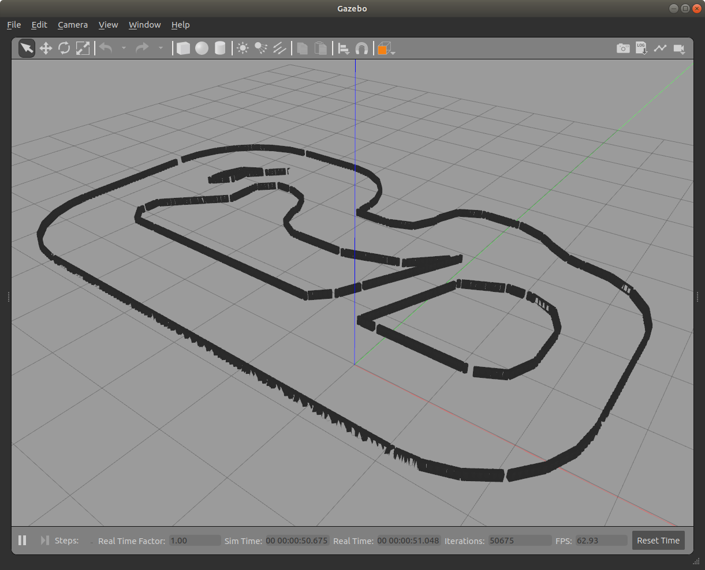

# gazebo_models

Gazeboで使用するモデルファイルをまとめたリポジトリ

---

- 実行環境

  - Ubuntu 18.04
  - ROS (Melodic)
  - Gazebo 9 (version 9.0.0)

- 使用方法

  1. Gazeboをインストールする

  ```bash
  $ sudo apt update
  $ apt install gazebo9
  ```

  2. Gazeboモデルフォルダを作成する

  ```bash
  $ cd ~/.gazebo
  $ git clone https://github.com/DaiGuard/gazebo_models
  ```

  3. Gazeboモデルパスを設定する

  ```bash
  $ echo "export GAZEBO_MODEL_PATH=$GAZEBO_MODEL_PATH:$HOME/.gazebo/gazebo_models" >> ~/.bashrc 
  ```

- ## ai_course

  AIラジコンカー走行用コース

  

- ## tes2020_course

  TESフェスティバル2020用の自動運転ラジコンコース

  